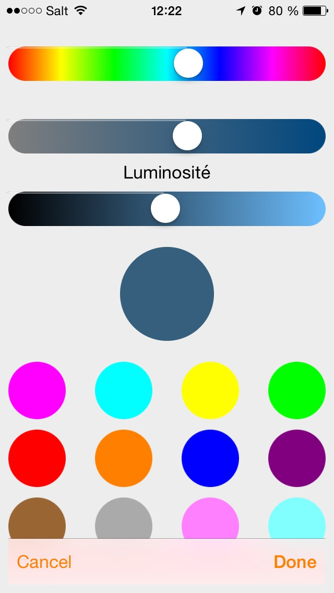

# JMMColorSelector-Swift
A color picker for iOS written in Swift (translated from Objective-C)

#### Easy to use
The API is intended to make it really simple to use.
##### Examples
In order to show the ViewController :
 
    // In your ViewController
    let colorSelectorVC = JMMColorSelectorViewController.init(nibName: "JMMColorSelectorView", bundle: nil)
    colorSelectorVC.delegate = self
    self.presentViewController(colorSelectorVC, animated: true, completion: nil)

##### Preview

